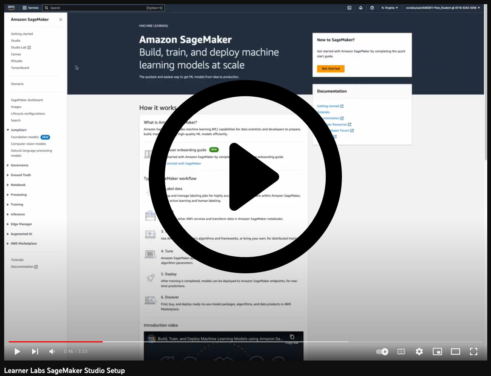
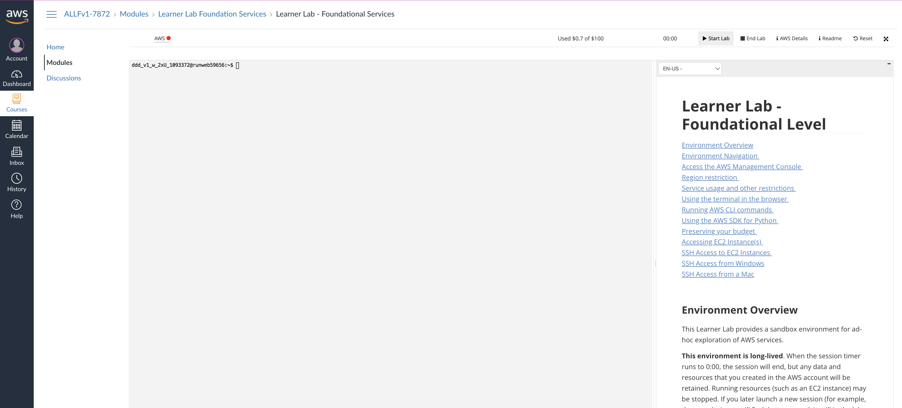
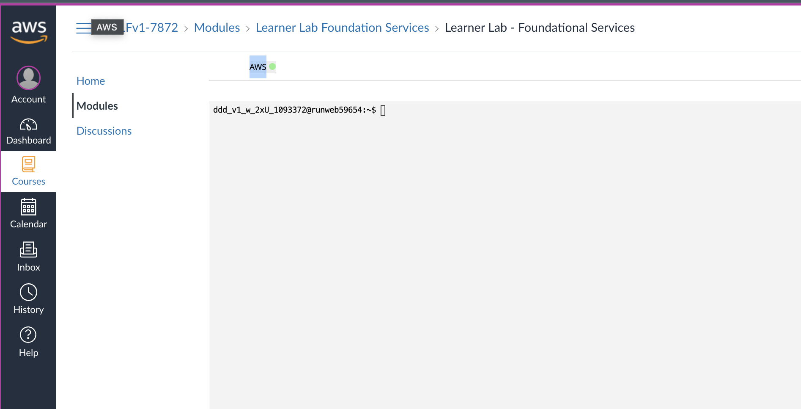
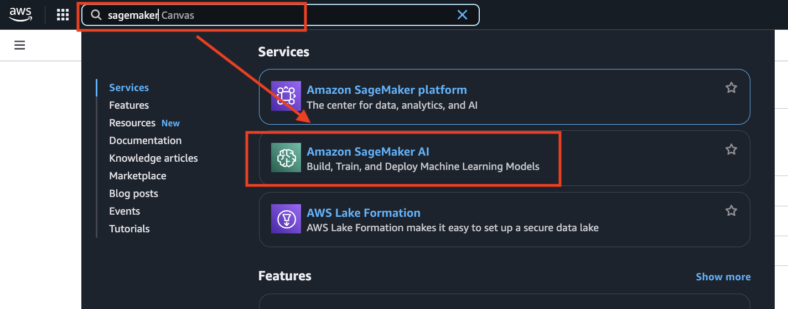
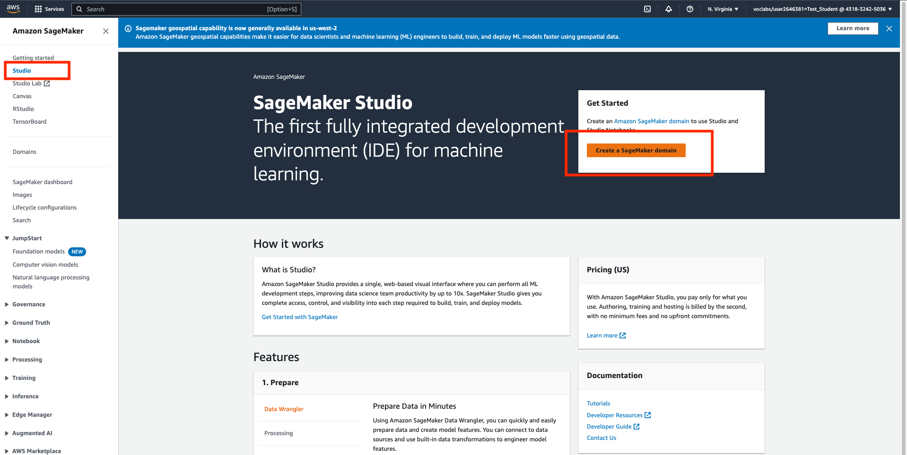
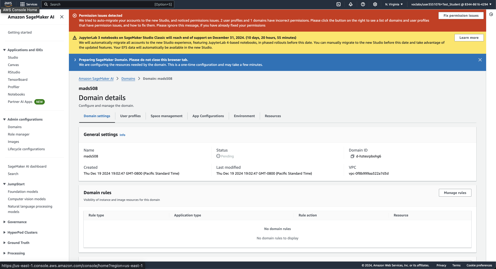
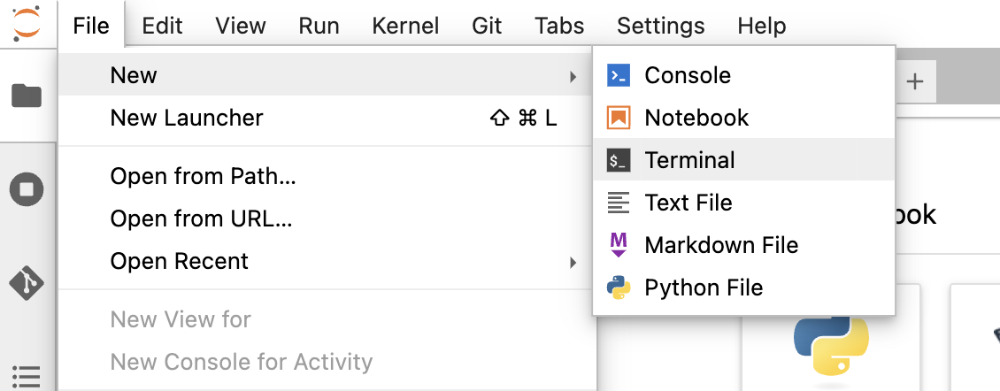

# ADS-508
This repo is adapted from the official [Data Science on AWS repo](https://github.com/data-science-on-aws/data-science-on-aws) and adjusted to reflect the capabilities of AWS Learner Labs.
[](https://www.amazon.com/Data-Science-AWS-End-End/dp/1492079391/)

# Important! :warning::warning::warning:

- In AWS Learner Labs once you reach $100 all of your code will be automatically destroyed. In addition, AWS Learner Labs has occasional issues where your environment is not accessible.
- **Be sure that you are ALWAYS storing your code in GitHub. You will not be given extra time to complete an assignment due to your Learner Lab deleting your code.**
- In order to make it easy to complete labs and work on your project, it is highly reccomended that you follow the below process twice, once for a `lab` user and once for a `project` user (be sure you are saving your work from the `project` user in your own GitHub repository.


# Setup Instructions
[](https://www.youtube.com/watch?v=FI3fPXOUVLQ)


## 1. Login to AWS Learner Labs


Be sure to read the [AWS Academy Learner Lab Student Guide.pdf](https://github.com/MADS508/labs/files/12005191/AWS.Academy.Learner.Lab.Student.Guide.pdf)


## 2. Launch the AWS Lab
Within the Learner Lab Setup Guide follow the steps in the [Using Your Learner Lab](https://ole.sandiego.edu/bbcswebdav/pid-2625324-dt-content-rid-35250884_1/xid-35250884_1) section.

1. From the Dashboard select your course. Then click `modules`


2. Click `Learner Lab`


3. In the top right click `Start Lab` This will take 2-3 minutes. Be sure to monitor your budget, once you reach $100 all of your code will be automatically destroyed. **Be sure that you are ALWAYS storing your code in GitHub. You will not be given extra time to complete an assignment due to your Learner Lab deleting your code.**


4. Once the lab has loaded you will see a green dot to the right of the AWS status, click it to open the AWS console.



## If the video indicates you need to attach an admin role, you can skip this step. As of Feb 2023 AWS Learner Labs no longer allows IAM role changes.

## 3. Launch SageMaker Studio

In the AWS Console search bar, type `SageMaker` and select `Amazon SageMaker` to open the service console.

Search for and select `SageMaker`


Select `Studio` and then click the button `Create Sagemaker domain`


Use the `Quick Setup` option with the `LabRole`. Use the name ``lab``, you will also want to make a second Studio named ``project`` which you will connect to your teams github repo (as oposed to the lab repo). Turn off the `Enable Canvas base permissions` option.  Ignore any `Access Denied` error messages that appear.


Wait 10-15 minutes for the studio to build. It only takes this long on initial setup, in the future it will take 2-3 minutes to access an existing studio.


Open the studio by clicking `Launch App` and then `Studio`


Wait 2-3 minutes for the studio to launch.


## 4. Launch a New Terminal within Studio

Click `File` > `New` > `Terminal` to launch a terminal in your Jupyter instance.




## 5. Clone this GitHub Repo in the Terminal

Within the Terminal, run the following:

```
cd ~ && git clone -b main https://github.com/mads508/labs.git

```

If you see an error like the following, just re-run the command again until it works:
```
fatal: Unable to create '.git/index.lock': File exists.

Another git process seems to be running in this repository, e.g.
an editor opened by 'git commit'. Please make sure all processes
are terminated then try again. If it still fails, a git process
may have crashed in this repository earlier:
remove the file manually to continue.
```
_Note:  Just re-run the command again until it works._
